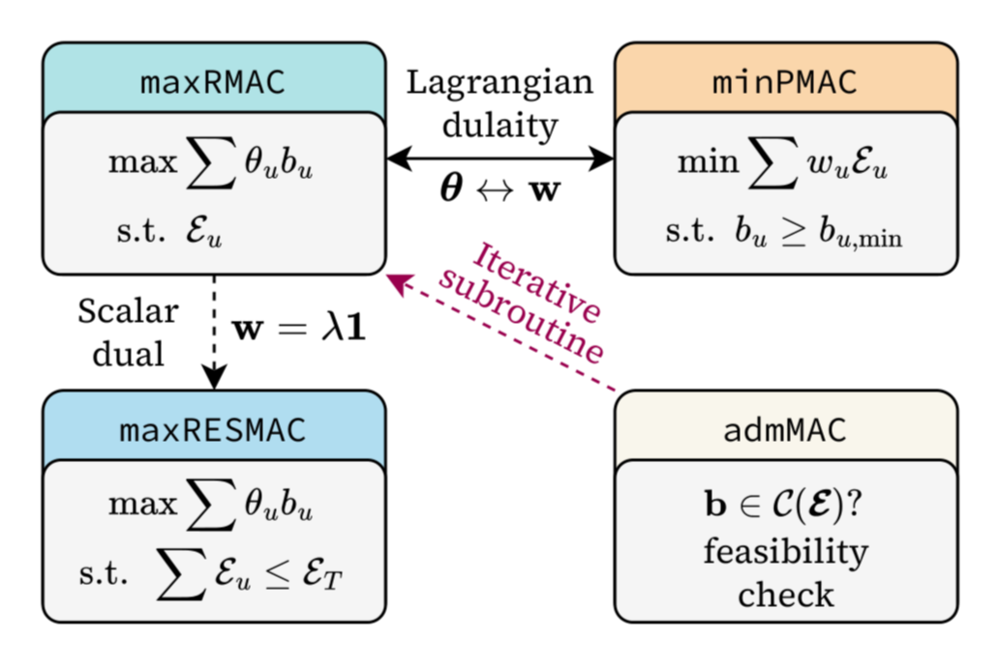

# Canonical MIMO MAC Design

Resource allocation in the multiple-input multiple-output (MIMO) multiple access channel (MAC) is a fundamental problem in multiuser communications, yet it is increasingly treated as non-convex and computationally intractable, which has motivated a large body of heuristic machine learning and successive approximation methods. This paper shows that the MIMO MAC admits canonical convex formulations and presents four solvers that together characterize its capacity region. `maxRMAC` performs weighted sum-rate maximization under per-user energy constraints, `minPMAC` finds the minimum weighted energy required to support target rates, `maxRESMAC` performs weighted sum-rate maximization under a total energy constraint, and `admMAC` tests rate-region feasibility. The solvers exploit the polymatroid structure of the MAC rate region and the separability of the dual Lagrangian across frequency tones, which reduces the problem to parallel per-tone covariance optimizations solved via limited-memory Broyden-Fletcher-Goldfarb-Shanno (L-BFGS) over Cholesky-like covariance factors. Experiments on spatially correlated MIMO orthogonal frequency-division multiplexing (OFDM) channels show that the proposed solvers match a commercial convex solver in solution quality while running up to two orders of magnitude faster and scaling to regimes where the commercial solver times out. Through broadcast channel (BC) to MAC duality, the same solvers also enable optimal precoder design for the MIMO BC.

<p align="center">
    
</p>

## Solvers

| Directory | Solver | Problem | Outer Method |
|-----------|--------|---------|--------------|
| `maxrmac` | `maxRMAC` | Weighted sum-rate maximization, per-user energy constraints | Ellipsoid on energy multipliers $\mathbf{w}$ |
| `minpmac` | `minPMAC` | Minimum weighted energy for target rates | Ellipsoid on rate weights $\boldsymbol{\theta}$ |
| `maxresmac` | `maxRESMAC` | Weighted sum-rate maximization, total energy constraint | Bisection on scalar multiplier $\lambda$ |
| `admmac` | `admMAC` | Rate-region feasibility test | Adaptive $\boldsymbol{\theta}$ + Frank-Wolfe |

All solvers exploit the polymatroid structure of the MAC rate region and the separability of the Lagrangian across frequency tones. Per-tone covariance subproblems are solved via L-BFGS over Cholesky-like factors, and the outer dual updates use either the ellipsoid method or bisection. Through BC-MAC duality, the same solvers also enable optimal MIMO broadcast channel precoder design.

Each directory contains:
- `<name>.m` >> MATLAB entry point, accepts `use_mex` flag to select backend
- `test_<name>.m` >> MATLAB test suite with MATLAB-vs-C++ comparison table
- `cpp/` >> C++ implementation, standalone test, and MEX gateway
- `cvx/` >> CVX reference formulation
- `utils/` or `src/` >> shared helpers

## Dependencies

| Dependency | Required by | Install |
|------------|-------------|---------|
| Eigen 3.3+ | all C++ | `brew install eigen` / `apt install libeigen3-dev` |
| OpenMP (`libomp`) | all C++ | `brew install libomp` / ships with GCC |
| GLPK | `minpmac` only | `brew install glpk` / `apt install libglpk-dev` |
| MATLAB with MEX SDK | MEX builds | — |

## Building

```bash
mkdir -p build && cd build
cmake .. -DCMAKE_BUILD_TYPE=Release
make -j$(nproc)
````

This produces:

* Static libraries: `maxrmac_lib`, `minpmac_lib`, `maxresmac_lib`, `admmac_lib`
* Standalone test binaries: `test_maxrmac`, `test_minpmac`, `test_maxresmac`, `test_admmac`
* MEX modules, if MATLAB is found: `maxrmac_mex`, `minpmac_mex`, `maxresmac_mex`, `admmac_mex`

MEX files are placed in their respective algorithm directories so MATLAB can find them on the path.

## Running tests

C++ standalone:

```bash
cd build
./test_maxrmac
./test_minpmac
./test_maxresmac
./test_admmac
```

MATLAB, from the repo root:

```matlab
run('maxrmac/test_maxRMACMIMO.m')
run('minpmac/test_minPMACMIMO.m')
run('maxresmac/test_maxRESMACMIMO.m')
run('admmac/test_admMACMIMO.m')
```

When MEX modules are present, the MATLAB tests run both backends and print a comparison table with per-test speedups.

## Citation

If you use this code, please cite:

```bibtex
@inproceedings{umer2026canonical,
  title     = {Canonical Optimization for {MIMO} {MAC} Design},
  author    = {Umer, Muhammad and Mohsin, Muhammad Ahmed and Cioffi, John M.},
  booktitle = {...},
  year      = {...}
}
```

## License

See [LICENSE](LICENSE).